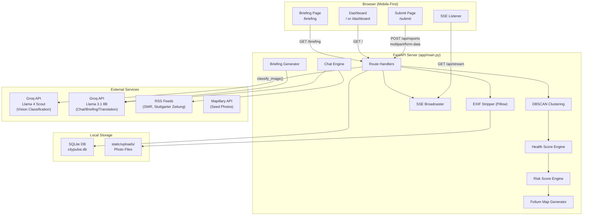
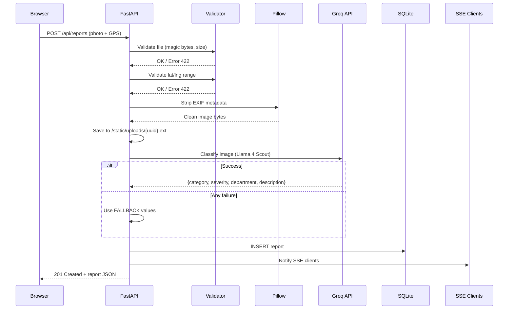
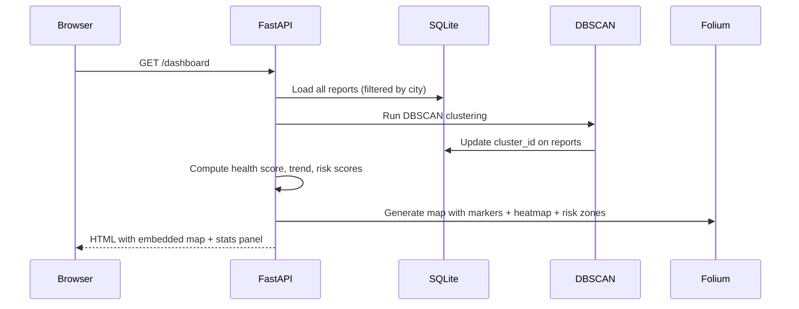
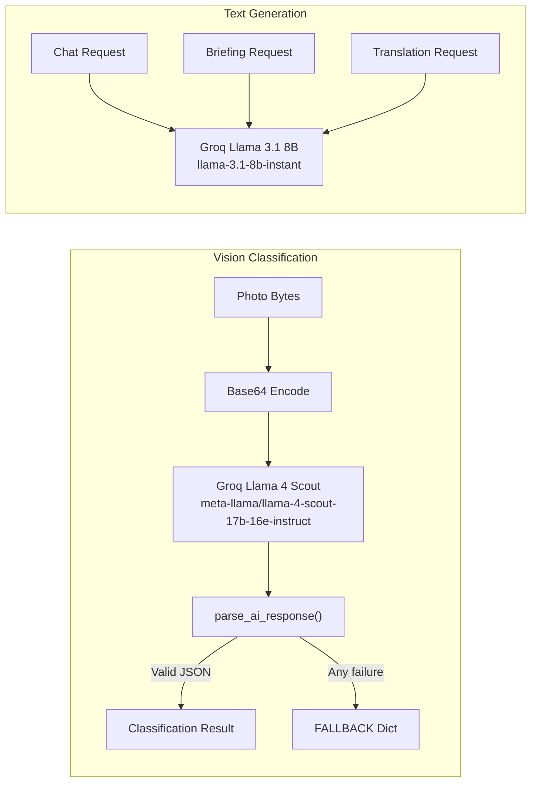
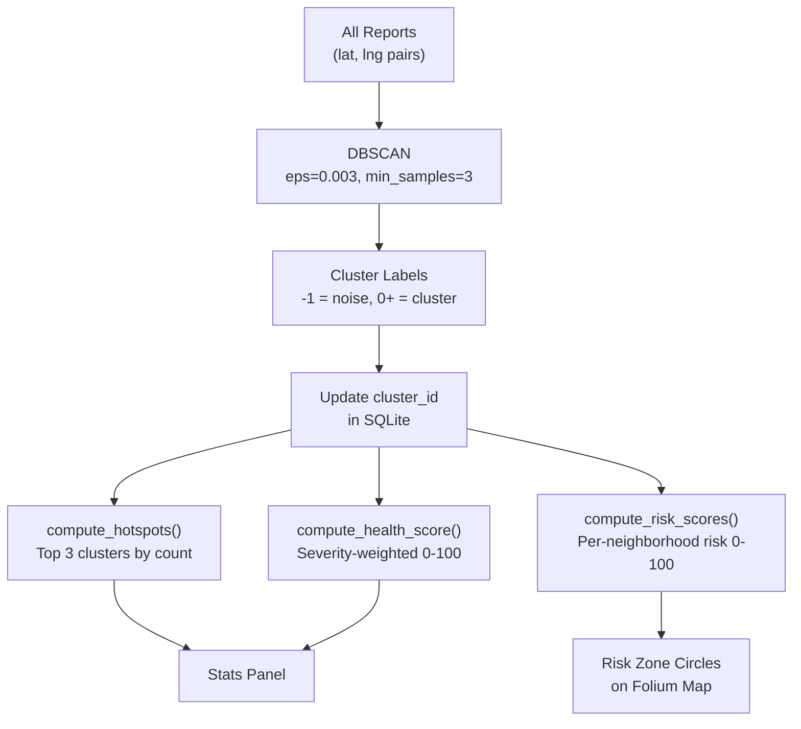
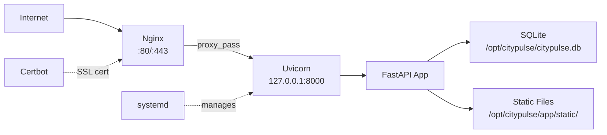

# CityPulse — Architecture

## System Architecture

## Design Pattern: Monolith with Module Extraction

The application follows a monolith pattern with selective module extraction:

| Module | Responsibility | Why Extracted |
|---|---|---|
| `main.py` | Routes, business logic, SSE, map generation | Central orchestrator — intentionally monolithic |
| `classifier.py` | AI vision classification + response parsing | Isolates external API dependency and fallback logic |
| `news.py` | RSS fetching + translation | Isolates external data source with caching |
| `models.py` | SQLAlchemy ORM model | Standard separation of data model |
| `database.py` | Engine, session, Base | Standard separation of DB infrastructure |

## Request Flow: Report Submission

## Request Flow: Dashboard

## AI Integration Architecture

All Groq API calls use `httpx.AsyncClient` with explicit timeouts. Every call has a fallback path — the app never returns 500 to users due to AI failures.

## Data Flow: Clustering → Dashboard

## Deployment Architecture

- Domain: `citypulse.help`
- Deploy script: `deploy.sh` (run on VPS as root)
- Process manager: systemd (`citypulse.service`)
- Reverse proxy: nginx with SSL via certbot
- Max upload: 12MB (nginx) / 10MB (app validation)
