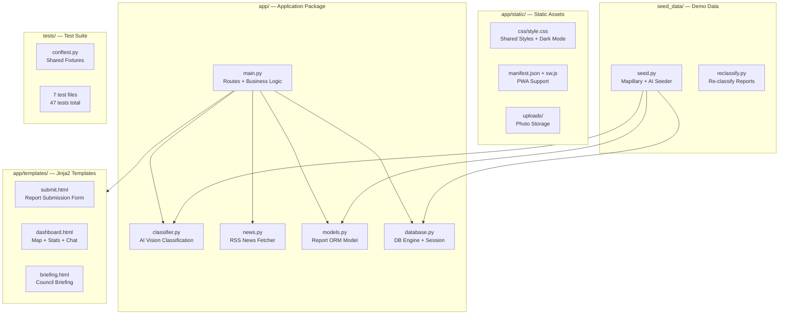

# CityPulse — Components

## Component Map

## Component Details

### `app/main.py` — Application Core

The central module containing all FastAPI routes and business logic. This is intentionally monolithic for hackathon speed.

**Subsystems within main.py:**

| Subsystem | Key Functions | Purpose |
|---|---|---|
| Report Submission | `create_report()`, `detect_file_type()`, `strip_metadata()` | File validation, EXIF stripping, AI classification, DB insert |
| Dashboard | `dashboard()`, `_build_dashboard_data()` | Clustering, scoring, Folium map generation |
| Citizen Engagement | `confirm_report()`, `update_report_status()` | Upvote/confirm system, status workflow |
| Analytics | `compute_health_score()`, `compute_trend()`, `compute_risk_scores()`, `compute_accessibility_score()` | Derived metrics from report data |
| Clustering | `run_clustering()`, `compute_hotspots()` | DBSCAN spatial clustering |
| AI Chat | `chat()`, `_build_report_stats()` | Context-aware chat with Groq Llama 3.1 8B |
| Briefing | `_generate_briefing()`, `_fallback_briefing()`, `_build_briefing_data()` | AI council briefing with data-driven fallback |
| SSE | `sse_stream()`, `notify_sse_clients()` | Real-time push to connected dashboards |
| Multi-City | `get_city()`, `nearest_city()`, `neighborhood_for_coords()` | City routing and neighborhood resolution |
| GeoJSON | `get_reports_geojson()` | Open data API for GIS integration |

**Deviation from defaults:** The `run_clustering()` function uses a module-level `_last_cluster_count` variable to skip re-clustering when the report count hasn't changed. This is a performance optimization, not a cache — it resets on server restart.

### `app/classifier.py` — AI Vision Classification

Handles image classification via Groq's Llama 4 Scout vision model.

| Function | Purpose |
|---|---|
| `classify_image(image_bytes)` | Async: encode image → call Groq → parse response → return classification or FALLBACK |
| `parse_ai_response(text)` | Parse JSON from AI response, strip markdown fences, validate enums |
| `_detect_mime(data)` | Detect MIME type from magic bytes |

**Fallback behavior:** Any failure (timeout, bad JSON, invalid enums, missing fields, auth error, rate limit) returns `FALLBACK` dict. The app never surfaces AI errors to users.

**FALLBACK values:** `category="unclassified"`, `severity="medium"`, `department="general"`, `description="Classification pending — AI service unavailable"`

### `app/news.py` — RSS News Fetcher

Fetches city-relevant news from RSS feeds, filters by city keywords, translates German headlines to English via Groq.

| Function | Purpose |
|---|---|
| `fetch_news(city_key)` | Fetch RSS → filter by keywords → translate → cache (15 min TTL) |
| `_translate_headlines(headlines)` | Groq Llama 3.1 8B translation |
| `_is_relevant(title, desc, keywords)` | Keyword-based relevance filter |

**Caching:** In-memory dict with 900-second TTL. Falls back to hardcoded `FALLBACK_NEWS` if all feeds fail.

**Circular import note:** `fetch_news()` imports `CITIES` and `DEFAULT_CITY` from `app.main` at call time (not module level) to avoid circular imports.

### `app/models.py` — Report Model

Single SQLAlchemy model with 13 columns and database-level constraints.

**Columns:** `id`, `photo_path`, `latitude`, `longitude`, `city`, `category`, `severity`, `department`, `description`, `cluster_id`, `confirmations`, `status`, `created_at`

**Check constraints:** Enforced at DB level for `latitude`, `longitude`, `category`, `severity`, `department`, `status`.

### `app/database.py` — Database Infrastructure

Minimal module: creates SQLAlchemy engine, session factory, and `Base` declarative base.

- DB file: `citypulse.db` in project root
- `check_same_thread=False` for FastAPI async compatibility
- `get_db()` is a FastAPI dependency yielding sessions

### `app/templates/` — Jinja2 Templates

| Template | Features |
|---|---|
| `submit.html` | Photo upload (drag-drop + camera), GPS via geolocation API, voice input (Web Speech API), map picker, privacy badge |
| `dashboard.html` | Embedded Folium map, stats panel, category/severity filters, AI chat widget, SSE live update toasts, dark mode toggle, city selector |
| `briefing.html` | AI-generated council briefing display, city selector |

### `seed_data/seed.py` — Demo Data Generator

Generates ~50 reports using real street-level photos from Mapillary, classified by AI. Falls back to Pexels photos. Skips reports if no photo source is available (no placeholder fallback in current implementation).

**Intentional clusters:** 8 potholes near Hauptbahnhof, 5 streetlights in Bad Cannstatt.

### `deploy.sh` — Deployment Script

Bash script for VPS deployment. Installs system deps, creates venv, configures systemd service, sets up nginx reverse proxy, obtains SSL cert via certbot. Target: `/opt/citypulse` on `citypulse.help`.
