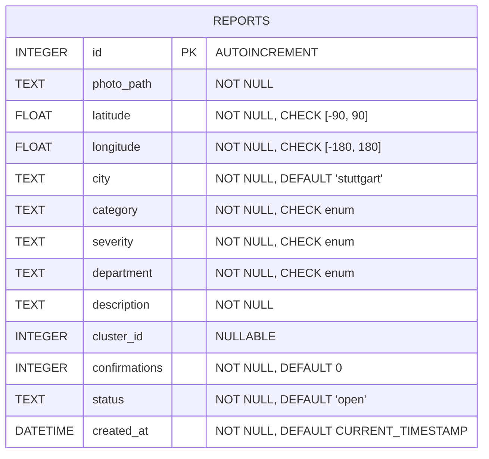
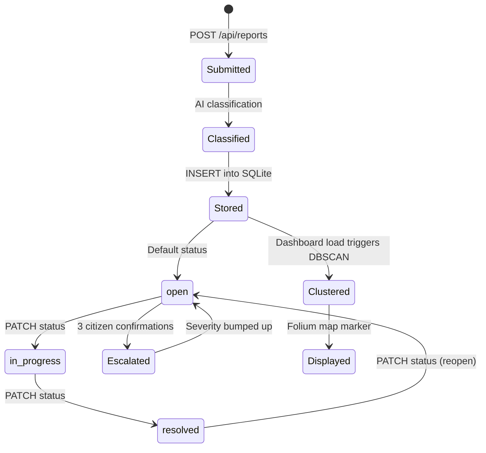

# CityPulse — Data Models

## Database: SQLite (`citypulse.db`)

Single table, single model.

## Report Model (`app/models.py`)



### Column Details

| Column | Type | Constraints | Description |
|---|---|---|---|
| `id` | INTEGER | PK, AUTOINCREMENT | Auto-increment primary key |
| `photo_path` | TEXT | NOT NULL | Relative path: `/static/uploads/{uuid}.{ext}` |
| `latitude` | FLOAT | NOT NULL, CHECK [-90, 90] | GPS latitude |
| `longitude` | FLOAT | NOT NULL, CHECK [-180, 180] | GPS longitude |
| `city` | TEXT | NOT NULL, DEFAULT 'stuttgart' | City key for multi-city support |
| `category` | TEXT | NOT NULL, CHECK enum | AI-classified issue type |
| `severity` | TEXT | NOT NULL, CHECK enum | AI-classified severity level |
| `department` | TEXT | NOT NULL, CHECK enum | AI-routed city department |
| `description` | TEXT | NOT NULL | AI-generated description, optionally merged with citizen text |
| `cluster_id` | INTEGER | NULLABLE | DBSCAN cluster assignment; NULL = noise/unclustered |
| `confirmations` | INTEGER | NOT NULL, DEFAULT 0 | Citizen upvote count |
| `status` | TEXT | NOT NULL, DEFAULT 'open' | Resolution workflow state |
| `created_at` | DATETIME | NOT NULL, DEFAULT CURRENT_TIMESTAMP | Report creation timestamp |

### Enum Values

| Column | Allowed Values |
|---|---|
| `category` | `pothole`, `streetlight`, `graffiti`, `flooding`, `dumping`, `sign`, `other`, `unclassified` |
| `severity` | `low`, `medium`, `high`, `critical` |
| `department` | `roads`, `electrical`, `sanitation`, `water`, `parks`, `general` |
| `status` | `open`, `in_progress`, `resolved` |

### Index

- `idx_reports_created_at` on `created_at` — used for trend calculations

### Schema Migrations

Handled in `lifespan()` via `ALTER TABLE` statements that check for column existence using `sa_inspect()`. Columns added post-initial schema: `confirmations`, `status`, `city`.

## In-Memory Data Structures

### City Configuration (`CITIES` dict in `main.py`)

```python
CITIES = {
    "stuttgart": {
        "name": "Stuttgart",
        "lat": 48.7758, "lng": 9.1829, "zoom": 13,
        "neighborhoods": [(lat_min, lat_max, lng_min, lng_max, name), ...],  # 17 neighborhoods
        "bbox": (48.70, 48.85, 9.10, 9.30),
        "news_keywords": {"stuttgart", "cannstatt", ...},  # 18 keywords
        "rss_feeds": ["https://...", ...],  # 2 feeds
    }
}
```

### Weight Maps

| Map | Location | Purpose |
|---|---|---|
| `SEVERITY_WEIGHTS` | `main.py` | `{"low": 1, "medium": 2, "high": 3, "critical": 5}` — health score calculation |
| `SEVERITY_COLORS` | `main.py` | `{"low": "green", "medium": "orange", "high": "orange", "critical": "red"}` — map markers |
| `ACCESSIBILITY_WEIGHTS` | `main.py` | Per-category weights for accessibility impact scoring |
| `SEVERITY_ESCALATION` | `main.py` | `{"low": "medium", "medium": "high", ...}` — auto-escalation at 3 confirms |

### Classification Fallback

```python
FALLBACK = {
    "category": "unclassified",
    "severity": "medium",
    "department": "general",
    "description": "Classification pending — AI service unavailable",
}
```

### News Cache

```python
_cache: dict = {
    "stuttgart": {"items": [{"title": "...", "link": "..."}], "ts": float}
}
```

In-memory dict with 900-second TTL. Not shared across workers.

## Data Flow: Report Lifecycle


