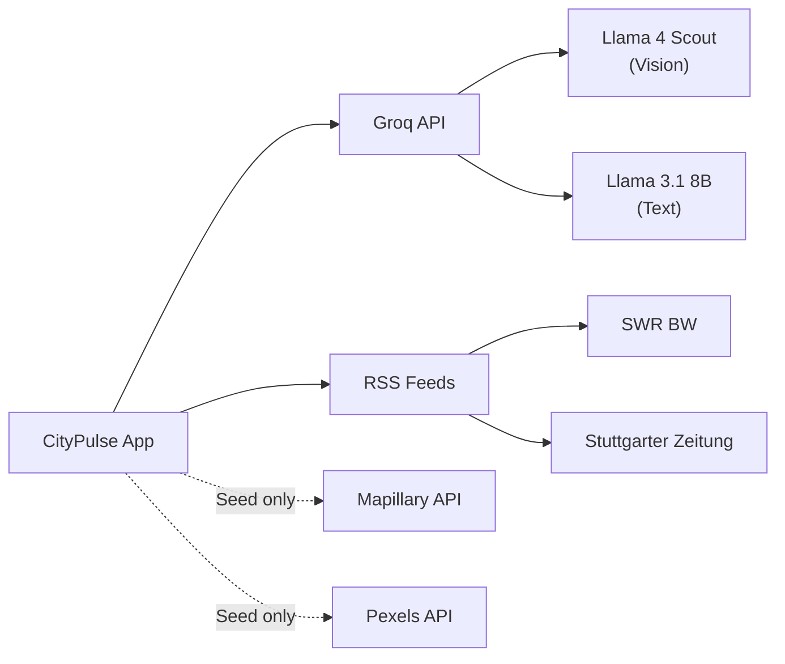
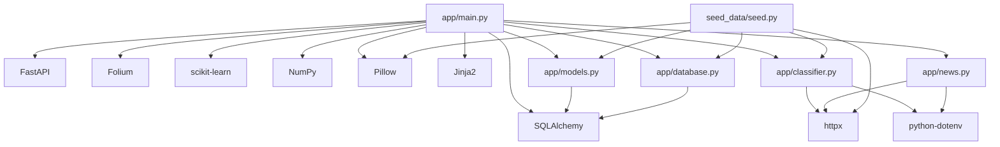

# CityPulse — Dependencies

## Python Dependencies (`requirements.txt`)

| Package | Version | Purpose |
|---|---|---|
| `fastapi` | Latest | Web framework — routes, dependency injection, request handling |
| `uvicorn[standard]` | Latest | ASGI server with WebSocket/HTTP2 support |
| `sqlalchemy` | Latest | ORM — Report model, session management, SQLite engine |
| `python-dotenv` | Latest | Load `.env` file into environment variables |
| `httpx` | Latest | Async HTTP client — Groq API calls, RSS fetching, Mapillary/Pexels (seed) |
| `folium` | Latest | Server-side Leaflet map generation with heatmap + layer control |
| `scikit-learn` | Latest | DBSCAN clustering algorithm |
| `numpy` | Latest | Coordinate array processing for DBSCAN input |
| `jinja2` | Latest | HTML template rendering |
| `python-multipart` | Latest | Multipart form data parsing (file uploads) |
| `Pillow` | Latest | EXIF metadata stripping from uploaded images |

## Dev/Test Dependencies (not in requirements.txt)

| Package | Purpose |
|---|---|
| `pytest` | Test runner |
| `httpx` | Also used by FastAPI's TestClient internally |

## External Service Dependencies

### Groq API

- **Required for:** Image classification, chat, briefing, news translation
- **Graceful degradation:** App works without API key — classification uses FALLBACK values, chat/briefing return error messages or data-driven fallbacks
- **Rate limits:** Free tier ~30 req/min; seed script adds 2s delay between calls
- **Models used:**
  - `meta-llama/llama-4-scout-17b-16e-instruct` — vision classification (30s timeout)
  - `llama-3.1-8b-instant` — chat (10s), briefing (15s), translation (8s)

### RSS Feeds

- **Required for:** News headlines in chat context and dashboard
- **Graceful degradation:** Falls back to hardcoded `FALLBACK_NEWS` if feeds are unreachable
- **Cache:** 15-minute in-memory TTL

### Mapillary API (Seed Only)

- **Required for:** `seed_data/seed.py` — fetching street-level photos
- **Not required at runtime**
- **Graceful degradation:** Reports without photos are skipped

### Pexels API (Seed Only — Legacy)

- **Referenced in seed script** but Mapillary is the primary source
- **Not required at runtime**

## System Dependencies (Deployment)

| Dependency | Purpose |
|---|---|
| Python 3.10+ | Runtime |
| nginx | Reverse proxy |
| certbot | SSL certificate management |
| systemd | Process management |

## Dependency Relationships

## No Dependencies On

- Docker / containers (bare metal deployment)
- PostgreSQL / MySQL (SQLite only)
- Redis / Celery (no background tasks)
- JavaScript frameworks (vanilla JS only)
- CSS frameworks (custom CSS)
- Cloud storage (local filesystem)
- Authentication libraries (no auth)
