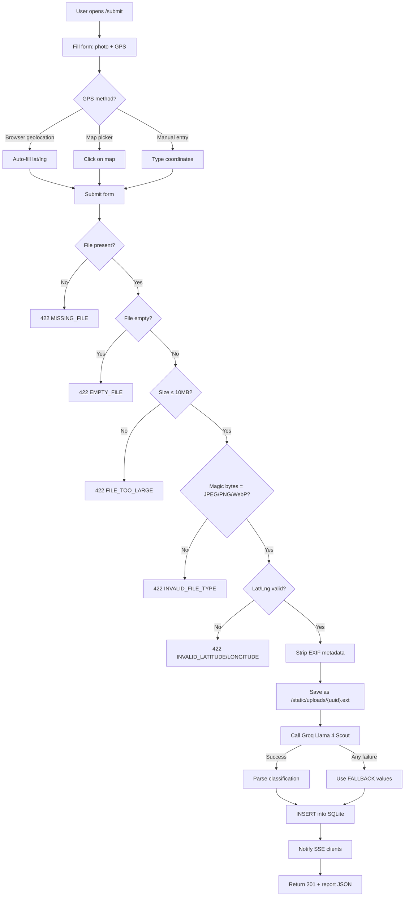
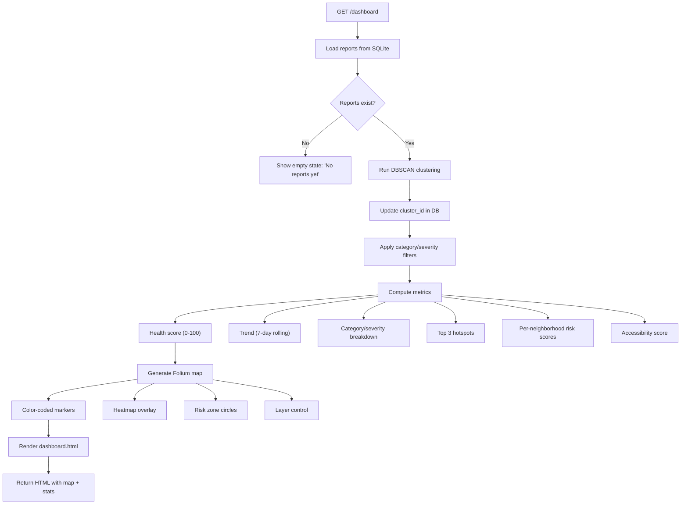
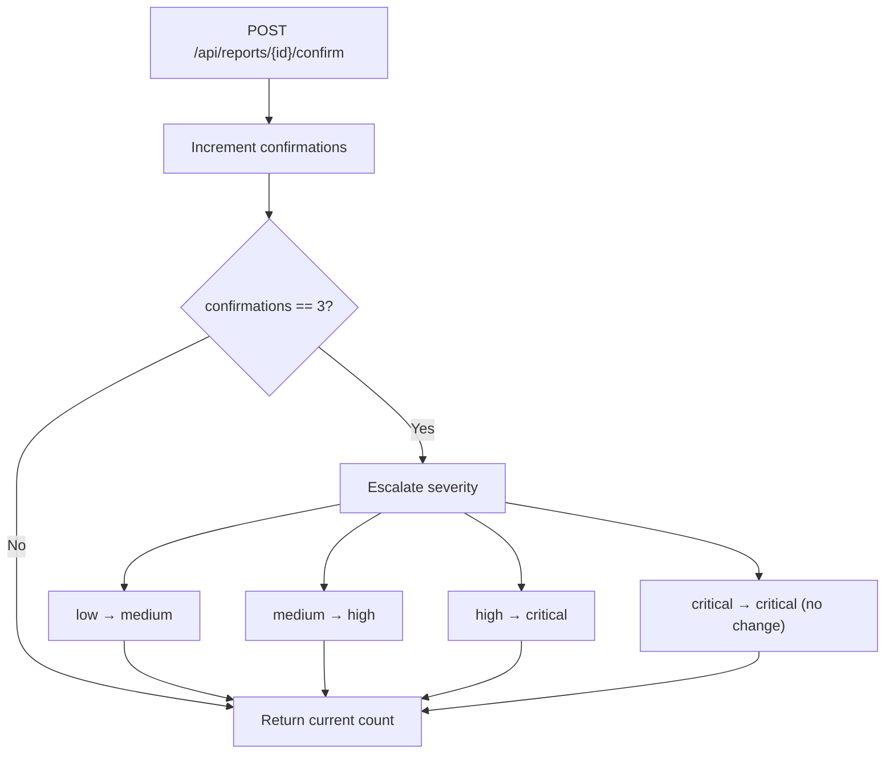
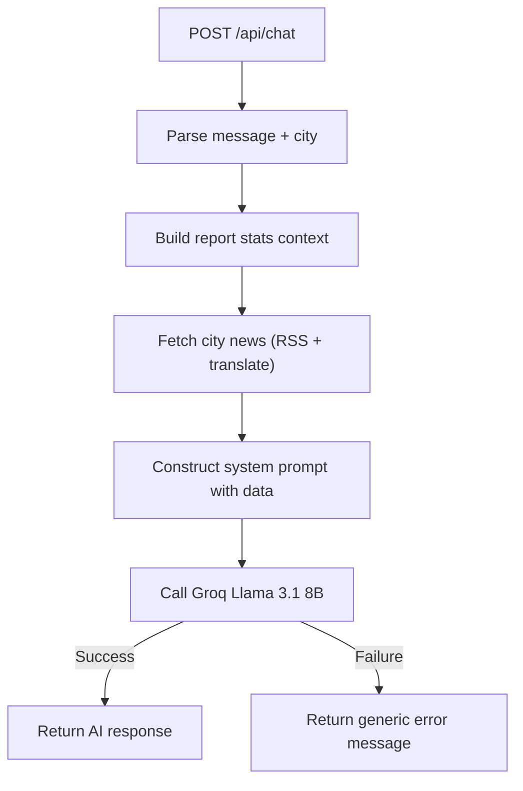
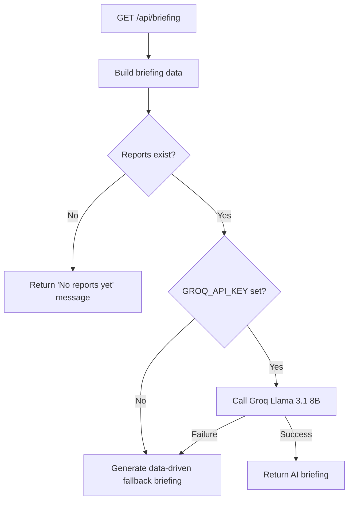
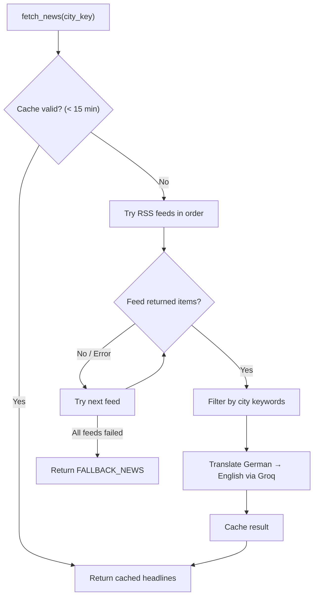
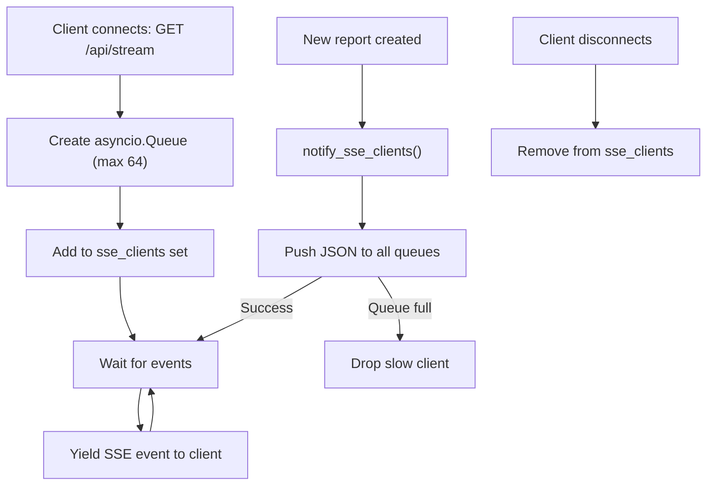
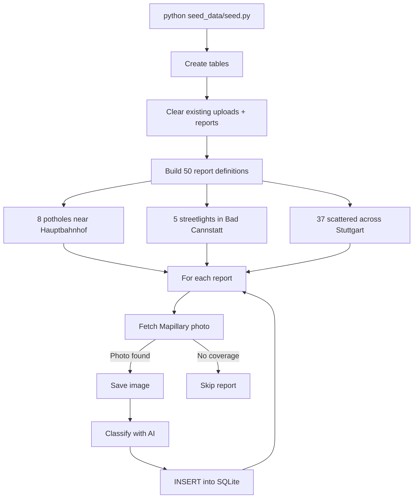
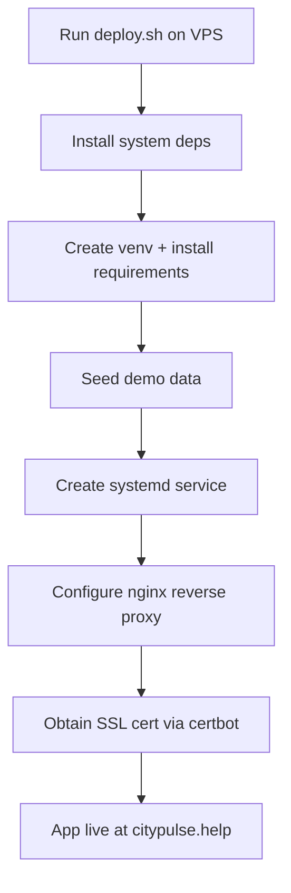

# CityPulse — Workflows

## 1. Report Submission Workflow

## 2. Dashboard Rendering Workflow

## 3. Citizen Confirmation & Auto-Escalation

## 4. AI Chat Workflow

**Chat context includes:** Total reports, health score, trend, category/severity breakdowns, per-category resolution rates, neighborhood risk scores, neighborhood breakdowns (top 7), and 20 most recent individual reports.

## 5. Council Briefing Workflow

The fallback briefing is generated from raw data without AI — it includes health score, top category, critical/high count, and top hotspot.

## 6. News Fetching Workflow

## 7. SSE Live Updates Workflow

## 8. Seed Data Workflow

## 9. Deployment Workflow

