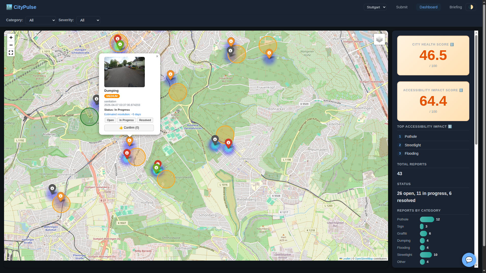
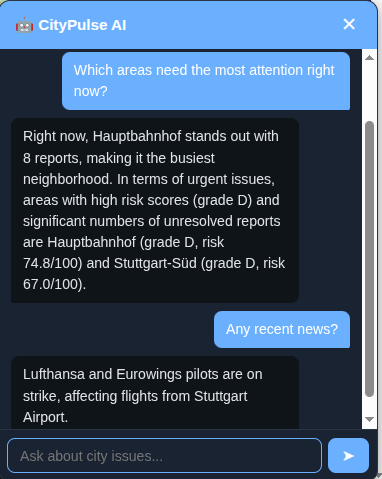
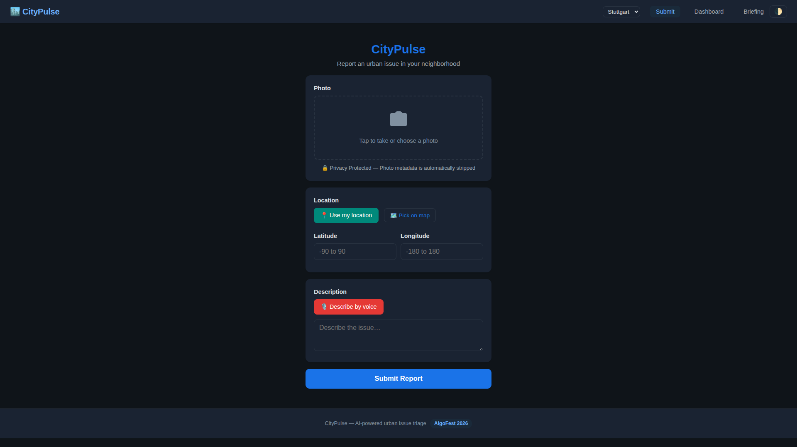
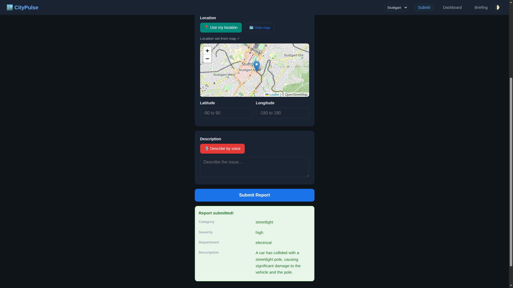
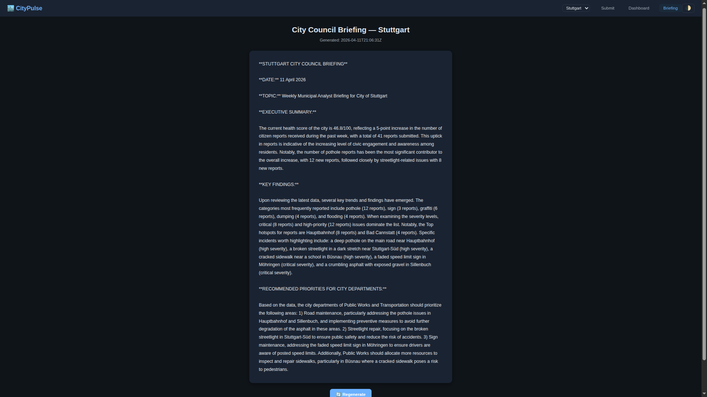

<p align="center">
  
</p>

<h1 align="center">CityPulse — AI-Powered Urban Issue Triage</h1>

<p align="center"><strong>Turn every citizen's phone into a smart city sensor.</strong></p>

🌐 **Live at [citypulse.help](https://citypulse.help)** &nbsp;|&nbsp; 📦 [GitHub](https://github.com/iheb-eddine/citypulse)

[](#)
[](#)
[](#running-tests)

Citizens snap a photo of an urban issue — pothole, broken streetlight, illegal dumping — and CityPulse does the rest. AI classifies the problem in seconds, routes it to the right city department, and clusters hotspots on a live dashboard so resources go where they're needed most. City officials get auto-generated council briefings, and an AI chat assistant answers questions about urban trends using real report data and local news.

---

## ✨ Features

| Feature | Description |
|---|---|
| 📸 **Photo Upload & AI Classification** | Upload a photo → Groq Llama 4 Scout vision model classifies category, severity, and department instantly |
| 🗺️ **Interactive Map Dashboard** | Folium/Leaflet map with color-coded markers, popups with status controls, and layer toggle |
| 🔥 **Heatmap Density Overlay** | Heatmap overlay shows report density across the city |
| 📊 **DBSCAN Spatial Clustering** | Groups nearby reports into actionable hotspots (eps=0.003, min_samples=3) |
| 💯 **City Health Score** | Severity-weighted metric (0–100) — a single KPI for urban wellbeing |
| ♿ **Accessibility Impact Score** | Weighted score factoring category impact on mobility and accessibility |
| 💬 **AI Chat Assistant** | Ask questions about city reports, trends, or local news — powered by Groq with live report context |
| 📋 **AI City Council Briefing** | Auto-generated formal briefing with executive summary, findings, and recommendations |
| 📡 **Real-Time SSE Live Updates** | Server-Sent Events push new reports to all connected dashboards with toast notifications |
| 👍 **Citizen Upvote/Verify** | Confirm reports — 3 confirmations auto-escalate severity |
| 🔄 **Resolution Workflow** | Track reports through open → in_progress → resolved |
| 🌍 **GeoJSON Open Data API** | Standard GeoJSON endpoint for integration with external GIS tools |
| 🔒 **EXIF Stripping & Privacy Badge** | All photo metadata is automatically stripped before storage |
| 🎙️ **Voice Report Submission** | Describe issues by voice using Web Speech API (browser-native) |
| 🏙️ **Multi-City Support** | City selector with per-city neighborhoods, news feeds, and map bounds |
| 🌓 **Dark Mode** | System-aware + manual toggle, persisted in localStorage |
| 📱 **PWA Support** | Service worker + manifest for installable mobile experience |
| 📰 **Local News Integration** | RSS feeds filtered by city keywords, auto-translated to English via Groq |

### 🧠 Algorithmic Intelligence Engine

| Feature | Description |
|---|---|
| 📈 **Bayesian Anomaly Detection** | Poisson-Gamma conjugate priors detect unusual report spikes per neighborhood — O(1) per observation, z-score alerts via SSE |
| 💰 **LP Budget Optimizer** | Linear programming (scipy.optimize.linprog) allocates maintenance budget across 6 departments with anomaly-weighted priorities |
| 🚐 **Crew Dispatch Optimization** | K-means clustering + nearest-neighbor + 2-opt TSP routes maintenance crews with provable distance savings |
| 📡 **IoT Sensor Simulator** | 20 virtual sensors (air quality, noise, vibration, water flow) with diurnal patterns feeding the anomaly engine |
| 🌊 **Graph Diffusion Prediction** | Heat equation on neighborhood Laplacian (scipy.linalg.expm) predicts where issues will spread in 7/14/30 days |
| 🔍 **pHash Duplicate Detection** | DCT-based perceptual hashing with Hamming distance detects duplicate/similar photo submissions |
| 🧩 **Pipeline Visualizer** | API showing which processing stages each report passed through (upload → classify → anomaly → budget → dispatch) |
| 🎯 **Chain-of-Thought Severity** | Rule-based explainability engine with 5 factors explaining WHY a severity was assigned |
| ⏱️ **Time-Lapse Simulation** | API generating daily city health snapshots for playback animation |
| 🏥 **Observability & Alerts** | /health endpoint, structured JSON logging, per-endpoint p50/p95/p99 latency, error rate alerting |
| 🛡️ **SLA Survival Prediction** | Weibull survival curves S(t)=exp(-(t/λ)^k) predict resolution probability per report category and severity |
| 🔧 **Work Order Generator** | Topological dependency ordering (Kahn's algorithm) for multi-department work orders with critical path analysis |
| 🔍 **Transparency Dashboard** | Department SLA compliance scoring with exponential decay weighting and letter grades (A–F) |
| 🔗 **Granger Causality** | Cross-correlation proxy detecting lagged causal relationships between neighborhoods at 1–7 day horizons |
| 🎯 **Priority Scoring Engine** | Composite priority score: severity (0.30), age (0.20), confirmations (0.15), anomaly (0.15), SLA risk (0.20) |
| 🏥 **City Health History** | Per-neighborhood daily health score history with configurable time window (1–365 days) |

### 🖥️ Intelligence Dashboard

| Feature | Description |
|---|---|
| 🗺️ **Dispatch Route Visualization** | "Optimize Dispatch" button draws colored crew routes on the map with distance savings metric |
| 📊 **Budget Allocation Panel** | "Optimize Budget" button shows CSS stacked bar chart of department allocations |
| ⚠️ **Anomaly Alert Toasts** | Pulsing SSE-driven notifications when neighborhoods spike above 2σ baseline |
| ⚡ **Pipeline Flow Bar** | Animated horizontal bar showing data flowing through 5 processing stages on each new report |
| 📡 **Sensor Status Grid** | 4-column grid of 20 IoT sensors with real-time green/yellow/red status indicators |
| 🌊 **Diffusion Heatmap Overlay** | Animated heatmap showing predicted issue spread at 7/14/30 day horizons |
| ⏱️ **Time-Lapse Player** | Playback controls animating daily city health snapshots over time |
| 🔍 **Transparency Scores Panel** | Department transparency leaderboard with color-coded letter grades |
| 🛡️ **SLA Compliance Panel** | SLA survival curves and breach probability gauges per department |
| 🔧 **Work Order Visualization** | Active work orders displayed on map with dependency graph and status |
| 🔗 **Causality Network** | Force-directed graph showing lagged correlation links between neighborhoods |
| 📊 **Live Metrics Panel** | Real-time p50/p95/p99 latency, request rate, and error rate charts |

---

### ⚙️ Algorithm Complexity

| Algorithm | Time Complexity | Space Complexity | Module |
|---|---|---|---|
| DBSCAN Clustering | O(n log n) | O(n) | `main.py` |
| Bayesian Anomaly Detection | O(1) per observation | O(k) neighborhoods | `anomaly.py` |
| LP Budget Optimization | O(n) weight computation + O(1) LP (fixed 6-variable problem) | O(n) | `budget.py` |
| K-Means + 2-opt TSP | O(n·k·i + n²) | O(n·k) | `dispatch.py` |
| Graph Diffusion (matrix exp) | O(n³) | O(n²) | `diffusion.py` |
| pHash (DCT) | O(1) per image | O(1) | `phash.py` |
| Weibull Survival | O(1) per report | O(1) | `sla.py` |
| Cross-Correlation Causality | O(k²·d) | O(k·d) | `causality.py` |
| Kahn's Topological Sort | O(V+E) | O(V) | `workorders.py` |
| Priority Scoring | O(1) per report | O(1) | `priority.py` |
| Chain-of-Thought Severity | O(1) per report | O(1) | `severity_reasoning.py` |

> Where: n = reports, k = clusters/neighborhoods, i = iterations, d = days, V = departments, E = dependencies

---

## 🛠️ Tech Stack

| Technology | Role |
|---|---|
| **FastAPI** | Web framework and REST API |
| **SQLite + SQLAlchemy** | Database and ORM |
| **Groq API** | AI — Llama 4 Scout (vision classification), Llama 3.1 8B (chat, briefing, news translation) |
| **scikit-learn (DBSCAN)** | Geospatial clustering of reports |
| **Folium / Leaflet.js** | Interactive map with heatmap density overlay |
| **Pillow** | EXIF metadata stripping for privacy |
| **httpx** | HTTP client for Groq API, RSS feeds, seed data fetching |
| **Jinja2** | Server-side HTML templates |
| **NumPy** | Coordinate array processing for clustering |
| **SciPy** | Linear programming (linprog), matrix exponential (expm), DCT for perceptual hashing |
| **python-dotenv** | Environment variable management |
| **Vanilla HTML/CSS/JS** | Mobile-responsive frontend — no framework needed |

---

## 🏗️ Architecture

```
┌─────────────┐                              ┌──────────────────┐
│   Mobile     │  POST /api/reports           │    FastAPI        │
│   Browser    │ ──── photo + GPS ──────────▶ │    Server         │
│              │                              │                  │
│              │  GET /api/stream (SSE)       │  ┌────────────┐  │
│              │ ◀──── live updates ───────── │  │ SSE Engine │  │
└─────────────┘                              │  └────────────┘  │
                                             └───────┬──────────┘
                                                     │
                              ┌───────────────┬──────┴──────┬──────────────┐
                              ▼               ▼             ▼              ▼
                       ┌────────────┐  ┌───────────┐ ┌──────────┐  ┌───────────┐
                       │ Groq API   │  │  SQLite   │ │  DBSCAN  │  │  RSS/News │
                       │ Llama 4    │  │  Database │ │ Clustering│  │  Fetcher  │
                       │ Scout      │  └─────┬─────┘ └──────────┘  └───────────┘
                       └─────┬──────┘        │
                             │               │
                    category, severity,      │
                    department, description  │
                             │               │
                             └───────┬───────┘
                                     ▼
┌─────────────┐  GET /dashboard    ┌──────────────────┐
│   Browser    │ ◀──── map + ───── │  Dashboard Route  │
│              │    stats + chat   │  + Folium Map Gen │
└─────────────┘                    │  + Health Score   │
                                   │  + Heatmap        │
                                   └──────────────────┘
```

---

## 📁 Project Structure

```
citypulse/
├── app/
│   ├── __init__.py
│   ├── main.py              # FastAPI routes, clustering, health score, chat, briefing, SSE
│   ├── database.py          # SQLAlchemy engine and session
│   ├── models.py            # Report model with constraints
│   ├── classifier.py            # AI classification client (Groq Llama 4 Scout) + fallback logic
│   ├── news.py              # RSS news fetcher with city filtering + Groq translation
│   ├── config.py            # City configurations, constants, helpers
│   ├── analytics.py         # Health score, trends, clustering, risk computation
│   ├── observability.py     # Structured logging, /health, /metrics, error alerting
│   ├── anomaly.py           # Bayesian anomaly detection (Poisson-Gamma conjugate priors)
│   ├── budget.py            # LP budget optimizer (scipy.optimize.linprog)
│   ├── causality.py         # Cross-correlation causality detection between neighborhoods
│   ├── sensors.py           # IoT sensor simulator (20 virtual sensors)
│   ├── sla.py               # Weibull survival prediction for SLA compliance
│   ├── dispatch.py          # Crew dispatch optimization (K-means + 2-opt TSP)
│   ├── health_history.py    # Per-neighborhood daily health score history
│   ├── diffusion.py         # Graph diffusion prediction (heat equation on Laplacian)
│   ├── pipeline.py          # Pipeline stage visualizer
│   ├── priority.py          # Composite priority scoring engine
│   ├── severity_reasoning.py # Chain-of-thought severity explainability
│   ├── timelapse.py         # Time-lapse simulation (daily snapshots)
│   ├── transparency.py      # Department transparency scoring with exponential decay
│   ├── workorders.py        # Work order generator (Kahn's topological sort + critical path)
│   ├── phash.py             # Perceptual hash duplicate detection (DCT-based)
│   ├── templates/
│   │   ├── submit.html      # Mobile-first report submission (photo, GPS, voice, map picker)
│   │   ├── dashboard.html   # Map + stats + chat widget + SSE live updates
│   │   ├── landing.html     # Marketing landing page with feature showcase
│   │   └── briefing.html    # AI-generated city council briefing
│   └── static/
│       ├── css/style.css    # Shared responsive styles with dark mode
│       ├── manifest.json    # PWA manifest
│       ├── sw.js            # Service worker
│       ├── icon-192.svg     # PWA icon
│       ├── icon-512.svg     # PWA icon
│       └── uploads/         # Uploaded and seed images
├── seed_data/
│   ├── seed.py              # Generates demo reports using Mapillary street photos + AI classification
│   └── reclassify.py        # Re-classify existing reports with updated AI
├── tests/
│   ├── conftest.py          # Fixtures: in-memory DB, test client, mocks
│   ├── test_routes.py       # Basic route tests
│   ├── test_submit.py       # Report submission + validation tests (18 tests)
│   ├── test_transparency.py # Transparency scoring tests
│   ├── test_workorders.py   # Work order generator tests
│   ├── test_classifier.py       # AI classification parsing + fallback tests
│   ├── test_clustering.py   # DBSCAN clustering tests
│   ├── test_causality.py    # Cross-correlation causality tests
│   ├── test_dashboard.py    # Dashboard rendering tests
│   ├── test_health_score.py # Health score + trend + accessibility tests
│   ├── test_observability.py # Health endpoint, metrics, middleware tests
│   ├── test_anomaly.py      # Bayesian anomaly detection tests
│   ├── test_budget.py       # LP budget optimizer tests
│   ├── test_sensors.py      # IoT sensor simulator tests
│   ├── test_dispatch.py     # Crew dispatch optimization tests
│   ├── test_health_history.py # Health history API tests
│   ├── test_diffusion.py    # Graph diffusion prediction tests
│   ├── test_pipeline.py     # Pipeline visualizer tests
│   ├── test_reasoning.py    # Chain-of-thought severity tests
│   ├── test_sla.py          # Weibull survival prediction tests
│   ├── test_timelapse.py    # Time-lapse simulation tests
│   ├── test_phash.py        # pHash duplicate detection tests
│   └── test_priority.py     # Priority scoring engine tests
├── deploy.sh                # Deployment script
├── requirements.txt         # Python dependencies
├── .env.example             # Template for environment variables
└── .gitignore
```

---

## 🚀 Setup Instructions

### Prerequisites

- Python 3.10+
- A [Groq API key](https://console.groq.com/keys) (free tier works)

### 1. Clone and create virtual environment

```bash
git clone https://github.com/iheb-eddine/citypulse.git
cd citypulse
python -m venv .venv
source .venv/bin/activate
```

### 2. Install dependencies

```bash
pip install -r requirements.txt
```

### 3. Configure environment

```bash
cp .env.example .env
```

Edit `.env` and add your Groq API key:

```
GROQ_API_KEY=your-groq-api-key-here
```

> Without a valid key, image classification falls back to `"unclassified / medium / general"`. The app still works — AI features just degrade gracefully.

### 4. Seed demo data (optional)

```bash
python seed_data/seed.py
```

This fetches real street-level photos from Mapillary (with Pexels fallback), classifies them with AI, and creates reports across Stuttgart neighborhoods. Requires `MAPILLARY_TOKEN` and/or `PEXELS_API_KEY` in `.env` (see `.env.example`).

### 5. Run the app

```bash
uvicorn app.main:app --reload
```

### 6. Open in browser

| Page | URL |
|---|---|
| Landing page | [http://localhost:8000](http://localhost:8000) |
| Dashboard | [http://localhost:8000/dashboard](http://localhost:8000/dashboard) |
| Submit a report | [http://localhost:8000/submit](http://localhost:8000/submit) |
| Council briefing | [http://localhost:8000/briefing](http://localhost:8000/briefing) |

---

## 🧪 Running Tests

```bash
pip install pytest httpx
pytest tests/ -v
```

274 tests covering routes, submission validation, AI parsing/fallback, dashboard rendering, DBSCAN clustering, health score computation, observability, anomaly detection, budget optimization, IoT sensors, crew dispatch, pipeline visualization, severity reasoning, graph diffusion, time-lapse simulation, pHash duplicate detection, SLA survival prediction, work order generation, transparency scoring, cross-correlation causality, priority scoring, and city health history.

---

## 📡 API Endpoints

### Pages (HTML)

| Method | Path | Description |
|---|---|---|
| `GET` | `/` | Marketing landing page with feature showcase |
| `GET` | `/dashboard` | Interactive map dashboard with stats, chat, and live updates |
| `GET` | `/submit` | Mobile-first report submission form |
| `GET` | `/briefing` | AI-generated city council briefing |

### REST API

| Method | Path | Description |
|---|---|---|
| `POST` | `/api/reports` | Submit a report (multipart: photo, lat, lng, description, city) |
| `GET` | `/api/reports` | List all reports for a city (JSON) |
| `GET` | `/api/reports/geojson` | GeoJSON FeatureCollection of all reports |
| `GET` | `/api/dashboard` | Dashboard stats as JSON (health score, categories, hotspots) |
| `POST` | `/api/reports/{id}/confirm` | Upvote/verify a report (auto-escalates severity at 3 confirms) |
| `PATCH` | `/api/reports/{id}/status` | Update report status (open / in_progress / resolved) |
| `POST` | `/api/chat` | AI chat — ask about city reports, trends, or news |
| `GET` | `/api/briefing` | Generate city council briefing (JSON) |
| `GET` | `/api/stream` | SSE stream — real-time new report notifications |
| `GET` | `/api/reports/{id}/reasoning` | Chain-of-thought severity explanation for a report |
| `GET` | `/api/reports/{id}/duplicates` | Find perceptually similar photo submissions |
| `GET` | `/api/reports/{id}/sla` | Weibull survival prediction for a report |
| `GET` | `/api/reports/{id}/workorder` | Generate work order with dependency graph |
| `GET` | `/api/reports/{id}/priority` | Composite priority score for a report |
| `GET` | `/api/reports/priority` | All reports ranked by priority score |
| `GET` | `/api/budget/optimize` | LP-optimized budget allocation across departments |
| `GET` | `/api/dispatch/optimize` | K-means + 2-opt crew routing optimization |
| `GET` | `/api/predict/diffusion` | Graph diffusion prediction (7/14/30 day horizons) |
| `GET` | `/api/causality` | Cross-correlation causal links between neighborhoods |
| `GET` | `/api/sensors/status` | IoT sensor simulator status grid |
| `GET` | `/api/timelapse` | Daily city health snapshots for playback |
| `GET` | `/api/sla/summary` | SLA compliance summary across departments |
| `GET` | `/api/workorders/dependencies` | Department dependency graph |
| `GET` | `/api/transparency` | Department transparency scores with letter grades |
| `GET` | `/api/health/history` | Per-neighborhood daily health score history |
| `GET` | `/health` | Application health check (observability) |
| `GET` | `/metrics` | Request latency percentiles and error rates |

### POST /api/reports

**Request:** `multipart/form-data`

| Field | Type | Required | Constraints |
|---|---|---|---|
| `photo` | file | yes | JPEG, PNG, or WebP; max 10 MB |
| `latitude` | string | yes | -90 to 90 |
| `longitude` | string | yes | -180 to 180 |
| `description_text` | string | no | Citizen description (merged with AI description) |
| `city` | string | no | City key (defaults to nearest city) |

**Response (201):**

```json
{
  "id": 1,
  "photo_path": "/static/uploads/abc123.jpg",
  "latitude": 48.7758,
  "longitude": 9.1829,
  "category": "pothole",
  "severity": "high",
  "department": "roads",
  "description": "AI: Large pothole on main road | Citizen: Near the bus stop",
  "status": "open",
  "created_at": "2026-04-10 09:30:00"
}
```

---

## 📸 Screenshots

### Dashboard — Interactive map with risk zones, heatmap, and stats


### AI Chat Assistant — Actionable insights from report data and local news


### Submit Report — Photo upload, GPS, voice description, privacy badge


### AI Classification Result — Automatic category, severity, and department routing


### AI City Council Briefing — Auto-generated memo for city officials


---

## 📄 License

MIT License — see [LICENSE](LICENSE).

Built for [AlgoFest Hackathon 2026](https://algofest-hackathon26.devpost.com/) — Smart Cities & IoT track.
